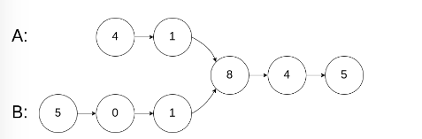

# 判断出相交的节点



## 朴素方法

``` js
const sameNode = (headA, headB) => {
    let nA = headA;
    let nB = headB;
    while (nA !== nB) {
        nA = nA === null ? headB : nA.next;
        nB = nB === null ? headA : nB.next;
    }
    return nA;
};
```

## 递归方法

``` js
const sameNode = (headA, headB) => {
    let nA = headA;
    let nB = headB;
    const walk = () => {
        if (nA === nB) return nA;
        nA = nA === null ? headB : nA.next;
        nB = nB === null ? headA : nB.next;
        return walk();
    };
    return walk();
};
```

