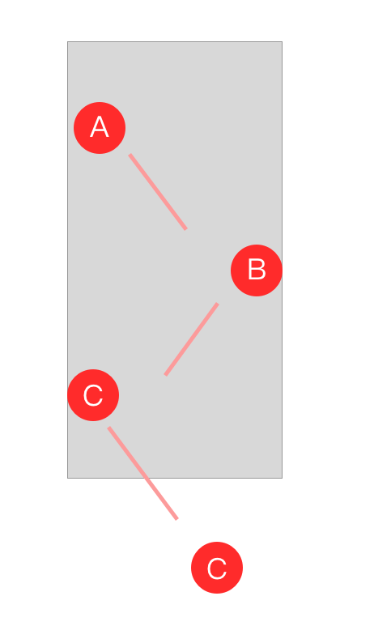

# record
## bytedance:
### 笔试：
1. 【简答】cdn原理及优化
2. 【简答】正则校验邮箱
3. 【简答】写出下列执行顺序
``` js
const a2 = async () => {
    console.log('async 2');
};

const a1 = async () => {
    console.log('async start');
    await a2();
    console.log('async end');
};

console.log('script start');

setTimeout(() => console.log('setTimeout'), 0);

a1();

new Promise(r => {
    console.log('promise');
    r();
}).then(() => console.log('promise2'));

console.log('script end');
```
4. 【简答】设计一个autoComplete组件
4. 【编程3选2】写一个有并发限制的异步调度器，任务最多有6个
5. 【编程3选2】实现semver.satisfies（版本比较）
6. 【编程3选2】二叉树路径之和

### 一面:
1. 说下第一道题，你说的强制缓存、协商缓存
2. 宏任务、微任务、以及async为什么是语法糖
3. autoComplete组件聊了一会
4. 版本比较能用正则写一下么
5. Symbol.for()、iterator、toPrimitive
6. 说说你的表单组件如何实现校验
7. 你们小程序300多页面，如何保证不崩溃
8. esm和cjs区别
9. [].reduce 用过吗，写下求和
10. http2说下
11. 想问你react，但你不会。问点基础吧，一波es6基础题

### 二面：
1. 表单校验
2. 你说做过级联组件，给你一组value，找出下标和值，要求性能
3. 你日历咋做的？如何获取当前月份天数，1号周几是怎么做的。
4. 移动端1px怎么做的，3种方法
5. 三列布局，左右固定100px，中间自动撑开，5种方法
6. 垂直居中，3种，还有吗？还有吗？
7. bfc
8. 下滑刷新怎么做的，touch事件有几个？touchcancel什么时候触发，你这个双指交替下拉怎么做到的
...

### 三面
1. 如下图，界面有3个小球A、B、C，A先移动，两秒走到和B相切，然后B开始移动，走到C相切，然后C移出去。
    - 如何保证一定相切后，下个小球才移动
    - 如果不能用transition呢
    - 你的定位都是左上角吧，如何调整坐标基准
    - canvas如何保证相切
    - 如何保证时间，手机电池都可能影响时间


2. 给你一个dom字符串，解析属性，生成ast
3. 忘了。。一些小题


## tencent
### 一面
1. 模块化：
    - 答： amd、cjs、esm、ts system；
    - cjs和esm有什么不同
    - ts如何兼容esm 和 cjs
    - esm里面const，作用域
    - 浏览器顶层对象一定是window吗？
    - 【编程】简单实现一下amd吧

2. http2
    - 有多少特性你知道
    - 一定要ssl吗

3. es6 说下
4. ts泛型
5. webpack
    - tree shaking
    - 性能优化
    - definePlugin
    - 多入口
    - postcss 插件

6. vue
    - time slicing 原理（不会）
    - 双向绑定 vue3做了什么，优点
    - slot 场景
    - tsx检测属性
    - vuex，namespaced，mutation和action区别

7. 算法：给一个数组，生成可能的bst
8. canvas、webgl 相关，不咋会
9. 性能这块，有什么想法

### 二面
1. 小程序为什么可以用类vue
2. react和vue有啥场景，为啥
3. 看政务小程序问组件
4. ts特性、除了约束还有什么
5. 小程序如何实现的，为啥要master-slaver 这种，你是如何实现单测的，gulp你是怎么配的，为什么要用gulp，pipe说下
4. 以后想做什么

### 三面
业务多些：做小程序最大的困难是什么；你的缺点是什么；你解决了什么；如何管理项目


