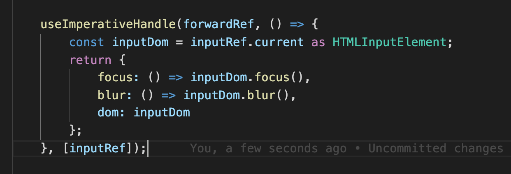

|序号|描述|解答|
|-|-|-|
|1|为什么组件class不用scoped|-|
|2|为什么要有getPopper，而不是直接ReactNode|-|
|3|getContainer 之所以要嵌套，是因为子节点比父节点先mounted吗？|-|
|4|sort 返回boolean 不行吗？交换和不交换|-|
|5||-|
|6|tsconfig-paths|-|

### 真可以解决eslint-unResolve
``` yaml
settings:
    import/resolver:
        node:
            paths: [src, node_modules]
            extensions: [.js, .jsx, .ts, .tsx]

        webpack:
            resolve:
                modules: [node_modules]
```

``` bash
npm i eslint-import-resolver-webpack -D
```
