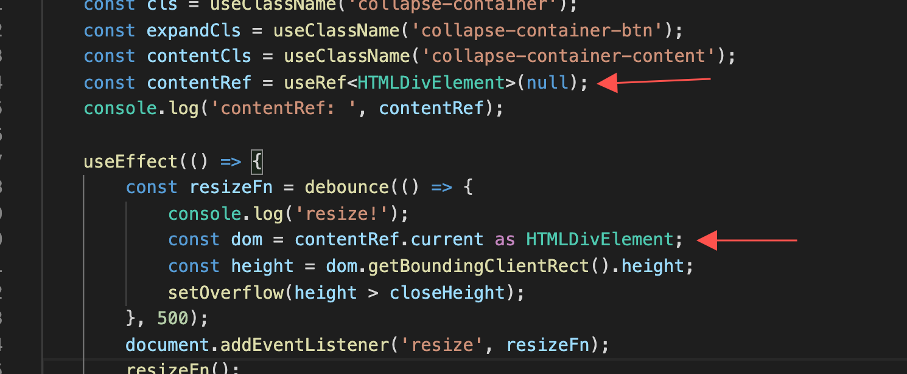

# ts问题
1. 为啥断言编译出错呢
``` ts
const getLen: (src: number | string) => boolean = src => {
    if (typeof (src as string).length == 'number') {
        return true;
    }
    return false;
};
```
结果：
``` js
var getLen = function (src) {
    if (typeof (src))
        as;
    string;
    length == 'number';
    {
        return true;
    }
    return false;
};
```

2. 类型断言和类型保护场景是啥？

3. 好丑的代码: 为啥想不到用数组呢？
``` ts
export default function buildURL(url: string, params?: any, serializer?: Function): string {
    if (!params) {
        return url;
    }
    // 判断url连接符号
    const join = /\?/.test(url) ? '&' : '?';
    url = url.replace(/#.+$/, '');

    if (serializer) {
        const result = serializer(params);
        return `${url}${result ? join : ''}${result}`;
    }

    let result = '';
    if (isObject(params)) {
        for (const [key, val] of Object.entries(params)) {
            if (Array.isArray(val)) {
                result += '&' + val.map(v => `${encode(key)}[]=${encode(v)}`).join('&');
            }
            else if (typeof val === 'object' && val !== null) {
                if (isDate(val)) {
                    result += `&${encode(key)}=${(val as Date).toISOString()}`;
                }
                else {
                    result += `&${encode(key)}=${encodeURI(JSON.stringify(val))}`;
                }
            }
            else if (val != null) {
                result += `&${encode(key)}=${encode(val + '')}`;
            }
        }
    }
    else {
        result = '' + encode(params);
    }
    result = result.slice(1);
    return `${url}${result ? join : ''}${result}`;
}
```

## 复习要点
1. jsx: preserve、react、react-native 都啥区别；vue render和react啥区别
2. 如何编译出cjs、esm都可用的模块
3. 类型申明空间（3个）
4. 变量申明空间
5. null/undefined 默认能赋值吗
6. 下面代码报错不?为什么
``` ts
const reverse = <T>(nums: T[]) => {
    const result = [];
    for (const val of nums) {
        result.unshift(val);
    }
    return result;
};
console.log('val', reverse(['1', '2', '3']));
```
7. 写一个extend（交叉类型）
8. 什么是元组
9. 引一个非 脚本类型,比如 import './style.css'; 如何避免报错?
10. implements 怎么用，是接口 implements 接口吗
11. 函数的2种申明方式？当想用重载要选哪种方式呢?

