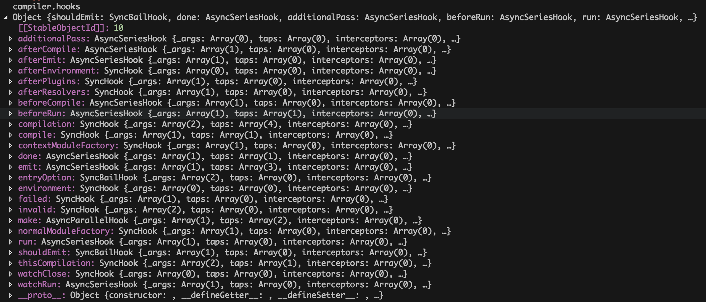
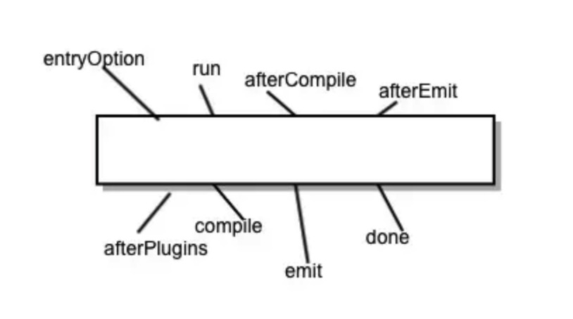
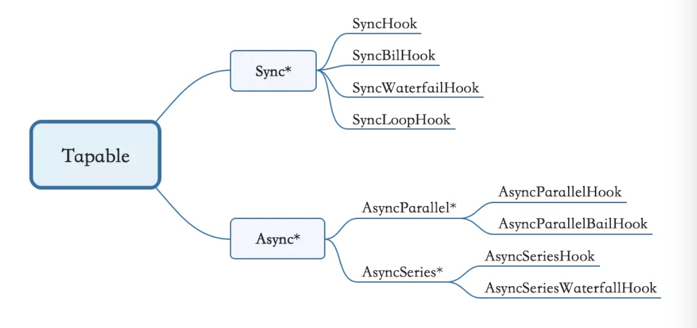

### 学习写一个plugin

webpack插件机制向第三方开发者提供了完整能力。使用阶段式的构造回调，开发者可以引入他们自己的行为到webpack构建流程中。
`创建plugin比loader更高级，需要理解底层特性`
---

1. 创建插件
webpack的插件由以下组成：
    - 一个js命名函数
    - 在函数的原型上定义apply方法
    - 指定一个绑定到webpack自身的事件钩子
    - 处理webpack内部实例的特定数据
    - 功能完成后调用webapck提供的回调

``` js
class MyPlugin {
    constructor(options) {}
    apply(compiler) {
        compiler.plugin('webpackEventHook', (compilation, cb) => {
            console.log('this is a explamPlugin');
            compilation.plugin('optimize', () => console.log('Assets are begin optimized.'));
            cb();
        });

        compiler.plugin('emit', (compliation, cb) => {
            setTimeout(cb, 1e3);
        });
    }
}
```

2. Compiler 和 Compilation
插件中最重要的两个资源是Compiler和Compilation，任何webpack插件都不可或缺，所以必须搞明白，特别是（compilation）
    - `compiler :` webpack配置环境
    - `compilation :` 代表依次资源版本构建。当运行webpack开发环境中间件时，每当检测一个文件变化，就会生成一个新的compilation，从而生成一组新的编译资源。一个compilation对象表现了当前的模块资源、编译生成资源、变化的文件、以及被跟踪依赖的状态信息。同时它也提供了很多关键时机的回调，一共插件做自定义处理时选择使用。

3. 基本插件架构
    1. 安装插件时，apply方法会被webpack compiler调用一次，apply方法可以接收一个webpack compiler对象的引用，从而可以在回调中访问compiler对象
    `似乎compiler.plugin('emit', callback)`废弃了，新版使用`compiler.hooks.compilation.tap`同步注册一个？
    

    2. compilation.options 是当前配置
 
 ---
#### 基本概念

1. 事件流编程： `Tapable`，暴露出挂载plugin的方法，例如compiler和compilation都是继承自它。


2. Tapable 是啥？
该库暴露了很多钩子(类方法)，为插件提供挂载的钩子
``` js
const { 
    // 同步钩子
	SyncHook,
	SyncBailHook,
	SyncWaterfallHook,
	SyncLoopHook,
    // 异步的
	AsyncParallelHook,
	AsyncParallelBailHook,
	AsyncSeriesHook,
	AsyncSeriesBailHook,
	AsyncSeriesWaterfallHook
 } = require("tapable");
```


3. 如何使用Tapable
``` js
new SyncHook // 实例化钩子
tap/tapAsync/tapPromise // 绑定钩子 
callAsync/call // 执行绑定事件
```
例如： 
``` js
const hook1 = new SyncHook(['arg1', 'arg2', 'arg3']);
// 绑定事件到webpack事件流
hook1.tap('hook1', (...args) => console.log(...args)); // 这个类似于 on
hook1.call(1, 2, 3); // 这个类似 emit, 然后触发上一句on，输出 1 2 3
```


``` js
const car = new Car();
car.tapPromise('bar', (...args) => new Promise(r => setTimeout(r, 1e3, ...args)));
car.call(123);
```


