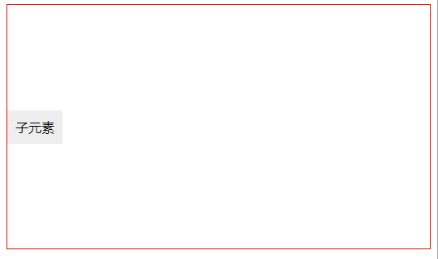

#### 1. 看代码，说问题
``` css
.parent
    display flex
    flex-flow column nowrap
    justify-content center

    .child
        background #eee
```

要实现这样的效果：



---

如果是水平轴没有任何问题，但如果是交叉轴，子元素读取父元素的 align-items,如果不设置（就像上面一样），则子元素的align-self 为auto，auto默认是strench，所以上面代码的结果是子元素拉伸了。
交叉轴居中 - 总结：
1. 如果是单个元素，则设置align-self为非`auto/strench`值
2. 否则设置父元素align-items就可以了


#### 2. v-for 一个数字，会从1 开始

``` js
<div v-for="i of 2"> {{i}}</div>

// 结果
// <div>1</div>
// <div>2</div>
```

#### 3. bash快捷键
``` css
删除上一个单词 ctrl + w
到单词末尾 alt + 右箭头
到单词头部 alt + 左箭头
到当前行头 ctrl + a
到当前行尾 ctrl + e
删除前面 ctrl + u
删除后面 ctrl + k
```
#### 4.
``` js
module.exports 和 module.export 啥区别
```
写错这个，然后webpack报错了。。-_ -

#### 5. loader倒着写是要：
``` js
loader: ['style-loader', 'css-loader', 'stylus-loader']
```
#### 6. 同步window.open 不会拦截， 第二个参数对应 target, 默认是`_blank`
``` js
el = document.querySelector('div');
el.addEventListener('click', () => {
    setInterval(e => window.open('//www.baidu.com'), 0);
}); // 只会打开一次，其余都会拦截
```
#### 7 node 8.5 正式支持esm
