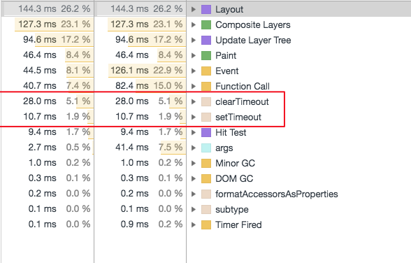
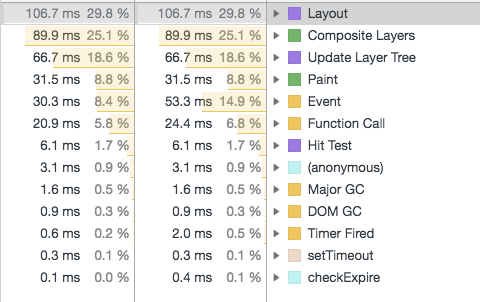

### flex-basis 遇到很长的数字会自动变长；width的文字会超出。
除非设置word-break: break-all

### 首行缩进
text-indent: length|percentage|inherit
1. 无法在行内元素生效
2. 初始值 0，具有继承性

### 空白字符 white-space
normal(default) | nowrap | pre | pre-wrap | pre-line | inherit
- 不继承
- 默认会合并所有空白符为1个字符
- js 可以处理\n 而html不行

### 如何判断 -0 和 +0 呢？
es6定义了same value equality，那么polyfill
``` js
// 1 / 0 === Infinity; 1 / -Infinity === -0;
isNegZero = a => a === 0 && 1 / a === -Infinity;
```
### Object.is
``` js
!Object.is && (Object.is = (a, b) => {
    // 判断 +-0
    if (a === 0 && b === 0) {
        return 1 / a === 1 / b;
    }

    // 判断 NaN
    if (a !== a) {
        return b !== b ;
    }

    // 其他情况
    return a === b;

});
```

看下面这个：
``` js
{
	const test = () => console.log(a);
	const a = 123;
	test();
}
```

判断promise
``` js
    export function isPromise(obj) {
        return obj && typeof obj.then === 'function' && typeof obj.catch === 'function';
    }
```

```
lodash 防抖
``` bash
lodash 的防抖可以设置三个参数: debounce(func, [wait = 0], [options = {}])
```

``` js
(_.debounce(() => {
	console.log('调用');
	return 999
}, 0, {leading: false}))(); // leading是之后执行，没有返回值


(_.debounce(() => {
	console.log('调用');
	return 999
}, 0, {leading: true}))(); // leading是马上执行，有返回值
```

``` js
/**
 * Creates a debounced function that delays invoking `func` until after `wait`
 * milliseconds have elapsed since the last time the debounced function was
 * invoked. The debounced function comes with a `cancel` method to cancel
 * delayed `func` invocations and a `flush` method to immediately invoke them.
 * Provide `options` to indicate whether `func` should be invoked on the
 * leading and/or trailing edge of the `wait` timeout. The `func` is invoked
 * with the last arguments provided to the debounced function. Subsequent
 * calls to the debounced function return the result of the last `func`
 * invocation.
 *
 * **Note:** If `leading` and `trailing` options are `true`, `func` is
 * invoked on the trailing edge of the timeout only if the debounced function
 * is invoked more than once during the `wait` timeout.
 *
 * If `wait` is `0` and `leading` is `false`, `func` invocation is deferred
 * until to the next tick, similar to `setTimeout` with a timeout of `0`.
 *
 * See [David Corbacho's article](https://css-tricks.com/debouncing-throttling-explained-examples/)
 * for details over the differences between `_.debounce` and `_.throttle`.
 *
 * @static
 * @memberOf _
 * @since 0.1.0
 * @category Function
 * @param {Function} func The function to debounce.
 * @param {number} [wait=0] The number of milliseconds to delay.
 * @param {Object} [options={}] The options object.
 * @param {boolean} [options.leading=false]
 *  Specify invoking on the leading edge of the timeout.
 * @param {number} [options.maxWait]
 *  The maximum time `func` is allowed to be delayed before it's invoked.
 * @param {boolean} [options.trailing=true]
 *  Specify invoking on the trailing edge of the timeout.
 * @returns {Function} Returns the new debounced function.
 * @example
 *
 * // Avoid costly calculations while the window size is in flux.
 * jQuery(window).on('resize', _.debounce(calculateLayout, 150));
 *
 * // Invoke `sendMail` when clicked, debouncing subsequent calls.
 * jQuery(element).on('click', _.debounce(sendMail, 300, {
 *   'leading': true,
 *   'trailing': false
 * }));
 *
 * // Ensure `batchLog` is invoked once after 1 second of debounced calls.
 * var debounced = _.debounce(batchLog, 250, { 'maxWait': 1000 });
 * var source = new EventSource('/stream');
 * jQuery(source).on('message', debounced);
 *
 * // Cancel the trailing debounced invocation.
 * jQuery(window).on('popstate', debounced.cancel);
 */
function debounce(func, wait, options) {
    debugger;
    let lastArgs,
        lastThis,
        maxWait,
        result,
        timerId,
        lastCallTime,
        lastInvokeTime = 0,
        leading = false,
        maxing = false,
        trailing = true;

    const isObject = obj => obj != null && (typeof obj === 'object' || typeof obj === 'function');
    const now = () => new Date().getTime();

    if (typeof func != 'function') {
        throw new TypeError('第一个参数必须是function');
    }

    wait = +wait || 0;

    if (isObject(options)) {
        leading = !!options.leading;
        maxing = Reflect.has(options, 'maxWait');
        maxing && (maxing = Math.max(+(options.maxWait) || 0, wait));
        Reflect.has(options, 'trailing') && (trailing = !!options.trailing);
    }

    function invokeFunc(time) {
        const args = lastArgs;
        const thisArg = lastThis;

        lastArgs = lastThis = undefined;
        lastInvokeTime = time;
        result = func.apply(thisArg, args);
        return result;
    }

    function leadingEdge(time) {
        // Reset any `maxWait` timer.
        lastInvokeTime = time;
        // Start the timer for the trailing edge.
        timerId = setTimeout(timerExpired, wait);
        // Invoke the leading edge.
        return leading ? invokeFunc(time) : result;
    }

    function remainingWait(time) {
        const timeSinceLastCall = time - lastCallTime;
        const timeSinceLastInvoke = time - lastInvokeTime;
        const result = wait - timeSinceLastCall;

        return maxing ? Math.min(result, maxWait - timeSinceLastInvoke) : result;
    }

    // 判断每次执行的时间差
    function shouldInvoke(time) {
        const timeSinceLastCall = time - lastCallTime; // lastCallTime 第一次执行为0
        const timeSinceLastInvoke = time - lastInvokeTime;

        // Either this is the first call, activity has stopped and we're at the
        // trailing edge, the system time has gone backwards and we're treating
        // it as the trailing edge, or we've hit the `maxWait` limit.
        // shoundInvoke 啥时候调用
        // (如果第一次执行 或者 上次执行时间大于 wait时间) 或者 (距上次执行时间 < 0 或者 距上次执行时间超过最大等待时间)
        // lastCallTime是哪来的: 是调用一次func时取了当前时间；那么啥时候time - lastCallTime会小
        return (lastCallTime === undefined || (timeSinceLastCall >= wait) ||
        (timeSinceLastCall < 0) || (maxing && timeSinceLastInvoke >= maxWait));
    }

    // 定时器的回调函数
    function timerExpired() {
        const time = now();
        if (shouldInvoke(time)) {
            return trailingEdge(time);
        }
        // Restart the timer.
        timerId = setTimeout(timerExpired, remainingWait(time));
    }

    function trailingEdge(time) {
        timerId = undefined;

        // Only invoke if we have `lastArgs` which means `func` has been
        // debounced at least once.
        if (trailing && lastArgs) {
            return invokeFunc(time);
        }
        lastArgs = lastThis = undefined;
        return result;
    }

    function cancel() {
        if (timerId !== undefined) {
            clearTimeout(timerId);
        }
        lastInvokeTime = 0;
        lastArgs = lastCallTime = lastThis = timerId = undefined;
    }

    function flush() {
        return timerId === undefined ? result : trailingEdge(now());
    }

    function debounced(...args) {
        const time = now();
        lastArgs = args;
        lastThis = this;
        lastCallTime = time;

        // 第一次调用，肯定是true，因为lastCallTime === undefined
        const isInvoking = shouldInvoke(time);

        if (isInvoking) {
            if (timerId === undefined) {
                return leadingEdge(lastCallTime);
            }
            if (maxing) {
                // Handle invocations in a tight loop. // 独占的循环
                timerId = setTimeout(timerExpired, wait);
                return invokeFunc(lastCallTime);
            }
        }
        if (timerId === undefined) {
            timerId = setTimeout(timerExpired, wait);
        }
        return result;
    }
    debounced.cancel = cancel;
    debounced.flush = flush;
    return debounced;
};

a = debounce(() => {
	console.log('调用');
	return 999
}, 2, {leading: false, maxWait: 3000});
```

``` bash
粗心 resolve.extensions, 不写'.js'报错
```

#### 自己写debounce
``` js
debounce = (fn, timeout) => {
    let timerId = null,
		lastArgs,
		context,
		result,
		lastCall;

	const invokeFn = (time) => {
		result = fn.apply(context, lastArgs);
		context = lastArgs = null;
        lastCall = undefined;
		return result;
    }

	const checkExpire = () => {
		console.log('执行2');
		const now = Date.now();
		const remainTime = timeout - (now - lastCall); // 关键： lastCall随着高阶函数的调用，越来越大， timeout - (now - lastCall) 一直大于 0，所以不执行
		if (remainTime <= 0) {
			return invokeFn(now);
		}
		timerId = setTimeout(checkExpire, remainTime);
	};

    return (...args) => {
		const now = Date.now();
		context = this;
		lastArgs = args;
		lastCall = now; // 上次调用时间

		if (lastCall == null) // || now - lastCall >= timeout) {

			console.log('执行1');
			// fn(); // 直接执行是不行的，因为如果第一次立刻运行，那么在timeout所有区间内都不运行了。
			// timerId = setTimeout(fn, timeout); // 这样不行，必定到期执行
			timerId = setTimeout(checkExpire, timeout);
		}
    };
};

f = debounce((a, b = '空') => console.log('fine', a, b), 5000);

f(1)
f(2)
f(3)
```

### simple
``` js
const debounce = (fn, delay) => {
    let timerId = null;
    return (...args) => {
        clearTimeout(timerId);
        timerId = setTimeout(fn, delay, ...args);
    };
};
```

### optimize
``` js
const debounce = (fn, delay = 0, immediate = false) => {
    let timerId = null;
    let lastCall;
    let context;
    let lastArgs;
    let result; // 返回值问题；leading 有用，trail没用

    const invokeFn = () => {
        fn.apply(context, lastArgs);
        return context = lastArgs = timerId = null;
    };

    const checkExpire = () => {
        const remainTime = delay - (Date.now() - lastCall);
        if (remainTime <= 0) {
            return invokeFn();
        }

        timerId = setTimeout(checkExpire, remainTime);
    };

    return function (...args) {
        context = this;
        lastCall = Date.now();
        lastArgs = args;

        if (!timerId) {
            timerId = setTimeout(checkExpire, delay);
            result = immediate && fn.apply(this, args);
        }
        return result;
    };
};
```

#### 来看性能



