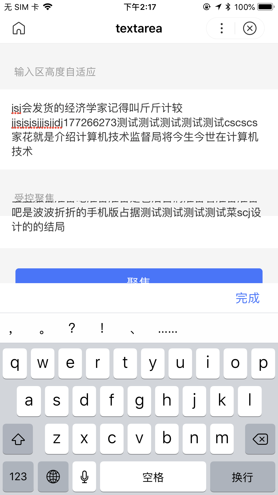
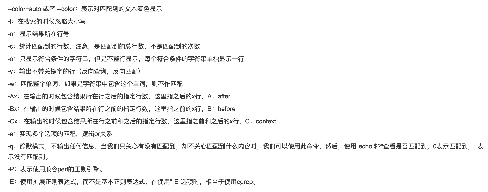

TypeError: Cannot redefine property: $app

http {
    client_max_body_size 20M;
}

vue Tsx 写错了，尴尬
``` js
export default class extends Tsx.Component<{}> {
    showLoading = false;
    sayName = e => { // 这样是不行的
        this.showLoading = true;
    }
}


<a-btn onClick={e => this.clkHdl(e)}>点击</a-btn> // 这样是ok的，模板里的this绑定正确
```
- 端上text-area问题：


- 按照现在端上的实现，有手风琴就无法 slot，以为控制列表事件

- props 的validator 不好用尴尬

- 如果父级computed 运算过多，那么注掉下面这句能防止自状态更新过快，造成错误选中
``` js
this.currentValue = checked;
```
但像折叠这种，不需要外部存一个值，自身赋值就可以了

- 来看下面折行，有bug： 筛选器后面去对比字符是否相等，如果相等就不重复触发了。结果就是
``` js
// norm([0, '']) === (['', 0]) 相等哈哈
const value = this.order.map(
    name => {
        const val = this.model[name].value;
        return val === false ? '' : val;
    }
).join('');
filterBody.itemChange({
    detail: {
        value
    }
});
```

- 设计list-item 要移动字而不是缩小边框
非常好的node教程:

https://zhuanlan.zhihu.com/p/86551700

- 试一下小数 加/减/乘/除
- 试一下字符匹配 substr
- 除法保留4位小数，乘法保留4位小数
- 使用流程语句
- 查找字符、并查看前4行、后4行、高亮、精确匹配、反向查找、多个目标


- selectAllComponents 有个问题
``` js
// 级联筛选取消选择 小程序bug: v-for所有已移除节点都选到
// const filters = this.selectAllComponents('.filter-content');
var SelectorQuery = swan.createSelectorQuery().in(this)
SelectorQuery.selectAll('.select-list > .filter-content')
.fields({id: true}, idList => {
    const filters = idList.map(({id}) => this.selectComponent(id));
    const current = Array.isArray(filters) && filters[this.lastActiveFilterIdx];
    current && typeof current.cancel === 'function' && current.cancel();
    this.$emit('cancel', this.lastActiveFilterIdx);
}).exec();
```

分支流：
1. 长期分支
2. 特征分支


- eventHub 三页可传

- setValue 还是明智的，不然无法联动

- 模板错误 骨架屏不消失

- 测试1

- 测试2

- 测试3

- 测试4

- 测试5

- 测试6

- 测试7
