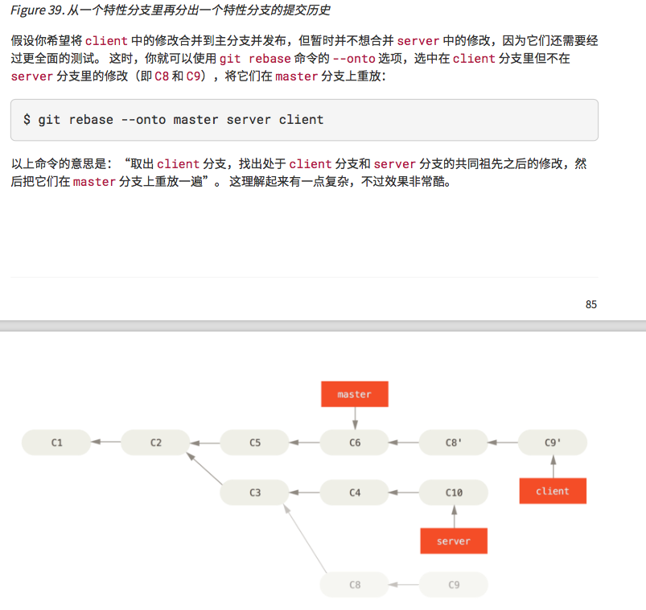

# merging是非破坏性操作，但无关commit太多，如果master分支很活跃，feather分支污染严重。

1. 如何关联远程分支
2. 如何查看关联的远程分支
3. 如何用fetch 快速merge
4. --no-ff 只是合并，但不会走到最新的节点
5. rebase 一定会分叉吗？
6. rebase -i 很多咋办

7. fecs 不要夹路径，不然.fecsignore就失效了

## 小程序开发坑
1. page 必须制定，不然 properties 里的默认值value不生效