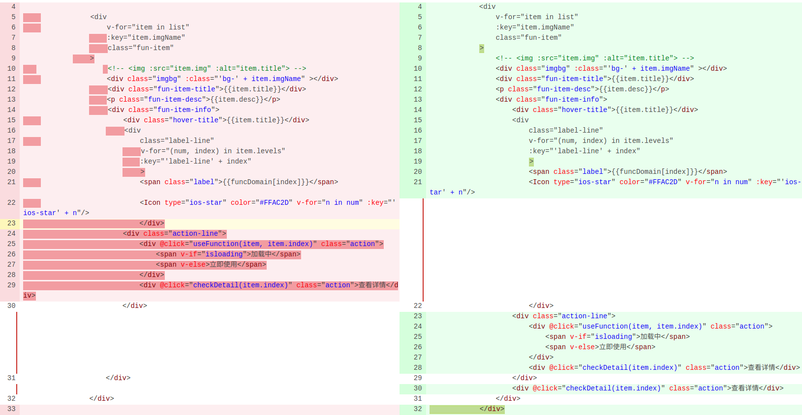
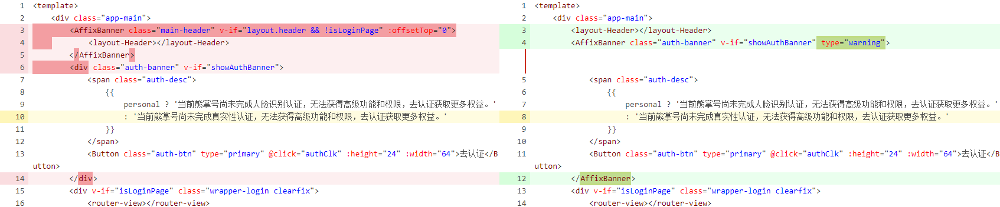

### 2018-11-20 上线导致delay
1. 即使发现了问题，我不该改别人的代码，因为他可能修复了，等我上线的时候，合并代码就发生了冲突。还会影响上线。
2. `不仔细cr` 这类问题出了太多，这次规定每次代码要cr半小时。太不认真了，真不该马虎

### 2018-10-30 上线导致delay
技术问题：
1. location.href 的方式只能是本页面，猜测因为不能赋值多个，所以永远是同步的
2. window.open 同步不会拦截，异步会拦截。如果是手动触发异步，只会放行第一个。如果是ajax异步，一个都打不开

上线问题：
1. 提前解决好代码冲突，30号上线,29号应该提完代码。
2. 习惯不好，diff之前，应该先在本地diff，然后再提再diff。

### 2018-10-05 首页改错
修改后没有本地diff，改了几次丢失了原有逻辑，最终导致出了问题。后来勇哥修的。

### 2018-10-02 flex-shrink 默认为1， flex-grow 默认为0
如果右侧内容太多，就会导致左侧挤压。

### 2019-05-21 列表出来了，但是能点吗？
需要检查的地方：1. 广告位置是否正常 2. 是否可点 3. 是否影响其他页面